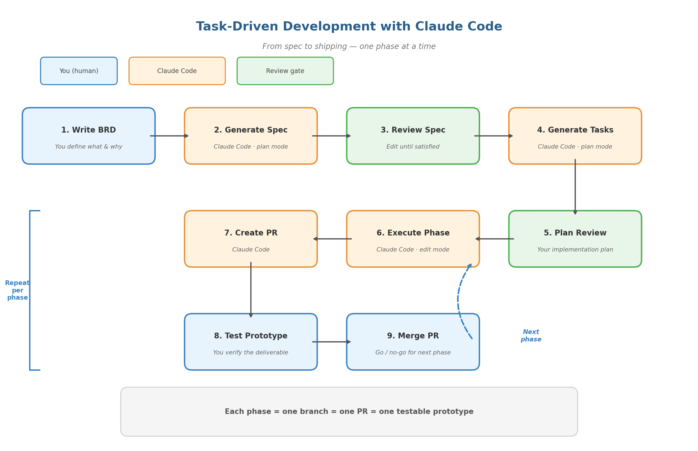

# Task-Driven Development with Claude Code

A hands-on tutorial for building software using a structured, phase-based workflow with [Claude Code](https://claude.ai/claude-code). The sample project (a URL Shortener API & Dashboard) is just the vehicle — the real goal is learning the workflow.

## What You'll Learn

How to go from a plain-language spec to a shipped application by following a repeatable cycle:

1. **Write a BRD** — You describe *what* you want and *why* (business goals, user stories, constraints).
2. **Generate a spec** — Claude Code turns your BRD into phases with concrete requirements and testable deliverables.
3. **Generate a task list** — Claude Code breaks the spec into granular, dependency-aware tasks. You review them as a plan review.
4. **Execute phase-by-phase** — Claude Code works through each task, runs acceptance criteria, and commits per task.
5. **PR & test** — Each phase ships as a GitHub PR you can review, test, and merge before moving on.

## Repo Contents

```text
tutorial/
  Tutorial.pdf        # Full tutorial document (start here)
  Tutorial.docx       # Editable version of the tutorial
docs/
  BRD.md              # Business Requirements Document (the "what & why")
  Architecture.md     # Tech stack and design preferences (optional)
README.md             # This file
```

The following files are generated during the tutorial and are **not** checked into this repo:

- `spec.md` — project spec with phases and deliverables (generated by Claude Code)
- `tasks.md` — detailed task list per phase (generated by Claude Code)
- `CLAUDE.md` — project-level instructions for Claude Code (generate with `/init`)
- All application source code, build artifacts, and dependencies

## Prerequisites

- [Claude Code](https://docs.anthropic.com/en/docs/claude-code) installed and authenticated
- Git configured with your GitHub account
- Node.js 18+

## Quick Start

```bash
# Clone and enter the repo
git clone https://github.com/tzamtzis/claude-code-task-workflow-tutorial.git
cd claude-code-task-workflow-tutorial

# Initialize the project
npm init -y

# Start Claude Code
claude
```

Read `tutorial/Tutorial.pdf` for the full step-by-step guide. The workflow summary below is a quick reference.

## The Workflow

### Step 1 — Generate the spec

Enter **plan mode** (`Shift+Tab`) and prompt:

> Read @docs/BRD.md and @docs/Architecture.md.
> Generate a spec.md with 2-4 phases, each having a branch name, concrete requirements, and a testable deliverable. Save as spec.md.

Review `spec.md`. Edit anything that doesn't match your intent.

### Step 2 — Generate the task list (plan review)

Still in plan mode:

> Read @docs/BRD.md, @docs/Architecture.md, and @spec.md.
> Create a detailed task list with titles, descriptions, acceptance criteria, and dependencies. Save as tasks.md with checkboxes.

Review `tasks.md` carefully — this is your implementation plan. Adjust granularity, dependencies, and acceptance criteria before proceeding.

### Step 3 — Execute a phase

Switch to **edit mode** (`Shift+Tab`) and prompt:

> We are starting Phase 1. Create branch phase-1/core-api, create native tasks (TaskCreate) for all Phase 1 items with dependencies, work through each task in order, run acceptance criteria, commit after each task, push when done.

### Step 4 — PR, test, repeat

After the phase completes:

> Create a GitHub PR targeting main titled "Phase 1: Core API" listing completed tasks and acceptance results.

Test the prototype yourself. Merge if satisfied. Start a fresh session (`/clear`) and repeat for the next phase.



## Sample Project — URL Shortener

The tutorial uses a URL shortener as the sample application:

| Phase | Branch | Deliverable |
| --- | --- | --- |
| **1 — Core API** | `phase-1/core-api` | REST API: shorten, redirect, stats |
| **2 — Dashboard UI** | `phase-2/dashboard-ui` | React frontend with URL management |
| **3 — Analytics & Polish** | `phase-3/analytics` | Click tracking, charts, rate limiting, custom codes |

## Useful Commands

| Command | What It Does |
| --- | --- |
| `Shift+Tab` | Cycle between Plan / Edit modes |
| `Ctrl+T` | Toggle native task list visibility |
| `/clear` | Clear context for a fresh session |
| `/compact` | Summarize conversation to free context |
| `/init` | Create/update CLAUDE.md with project instructions |
| `Escape` | Cancel Claude Code's current action |

## Further Reading

- [Claude Code in Action (Coursera)](https://www.coursera.org/learn/claude-code-in-action) — Free course covering fundamentals
- [Common Workflows — Official Docs](https://code.claude.com/docs/en/common-workflows) — Practical workflow recipes
- [Best Practices — Official Docs](https://code.claude.com/docs/en/best-practices) — CLAUDE.md design, context management
- [Native Task Management Guide](https://claudefa.st/blog/guide/development/task-management) — TaskCreate, dependencies, multi-session sync
- [Spec-Driven Development with Claude Code](https://alexop.dev/posts/spec-driven-development-claude-code-in-action/) — Real-world walkthrough of the spec-driven pattern

See `tutorial/Tutorial.pdf` Section 11 for a comprehensive list of additional training resources covering autonomous workflows, video walkthroughs, and community collections.

## License

ISC
